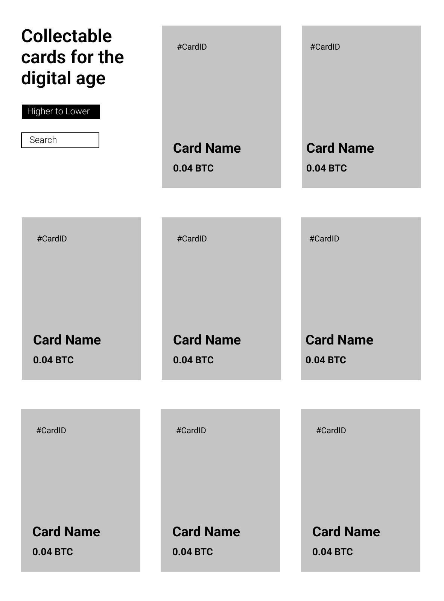

# pair-coding-interview

Setup:
- Make sure you're running Node 16.10.x or later
- run `npm run setup`
- run `npm start`

API URL `http://localhost:3000`

Requirements:
- Implement the wireframe design.
- Use the data from the `http://localhost:3000/cards` endpoint to populate the grid.
- Apply a background image to the cards. The image url is `http://localhost:3000/cards/{cardID}/image`
- Add an input field to filter the cards by instrument name
- When the screen is < 600px change the grid to display as a single column, and change the background to black, and the page title to white.
- Cards should be ordered by price.
- Add a button that inverts the order of the cards (by price)
- Add a 5px border to the left each card and alternate the colour.
- Continuously poll the data and show an "up-down" indicator in each card when the price changes depending on the direction

